# SQL Murder Mystery
# Detective: Valentina Garro Ramírez.

---

## Resumen del caso:
En este laboratorio se realizó una investigación por medio de consultas en SQL para así resolver un caso de asesinato
ocurrido el 15 de enero de 2018 en SQL City.
El objetivo principal de esta actividad fue analizar diferentes tablas de una base de datos para hallar pistas que permitieran identificar al culpable del asesinato.

Durante la investigación se analizó el reporte del crimen, las entrevistas a los testigos y los registro de otras tablas como: personas, membresias de Gym  y registros.
A partir de toda esta información proporcionada fue posible seguirle el rastro al sospechoso hasta identificar al responsable del crimen y a la responsable intelectual del asesinato.

Finalmente, haciendo uso de la consulta de verificación proporsionada por la página web, se confirmó tanto la identidad del asesiona como de la responsable intelectual.

---

## Bitácora de Investigación:
A continuación se documenta todo el proceso para resover el caso del SQL Murder Mystery. Se incluyen las consultas realizadas y las evidencias encontradas en casa paso.

## Paso 1: Revición del reporte del crimen.
``` sql 
SELECT *
FROM crime_scene_report
WHERE date = 20180115
AND city = 'SQL City'
AND type = 'murder';
``` 
Se hace la consulta para encontrar el reporte del crimen ocurrido el 15 de enero de 2018 en SQL City.
Arrojó como resultado la información del caso y reveló la existencia de dos testigos en el crimen.

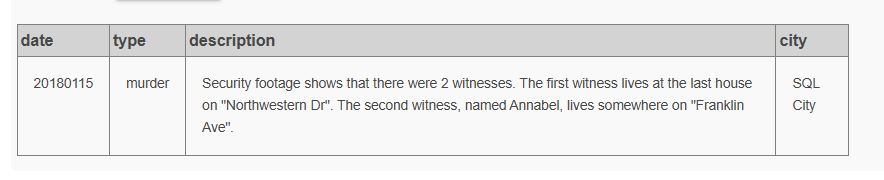

## Paso 2: Identificación del Primer Testigo.
``` sql
SELECT *
FROM person
WHERE address_street_name = 'Northwestern Dr'
ORDER BY address_number DESC;
``` 
En el reporte del crimen se menciona que uno de los testigos vive en Northwestern Dr.
Se utilizó esta consulta para encontrar a las personas que viven en esa calle y con la ayuda de reporte inicial dar con el testigo correcto.

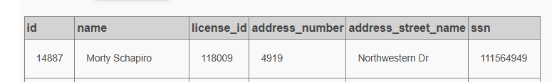

## Paso 3: Revisión de la Entrevista del Primer Testigo.
``` sql
SELECT *
FROM interview
WHERE person_id = 14887; 
```
Se consulta la tabla de entrevistas para revisar la declaración del primer testigo.
Esta entrevista proporciona pistas importantes sobre el sospechoso.

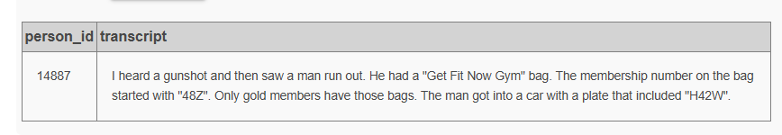

## Paso 4: Identificación del Segundo Testigo.
``` sql
SELECT *
FROM person
WHERE name LIKE 'Annabel%'
AND address_street_name = 'Franklin Ave';
```
En el reposte del crimen también se hace mención de una segunda testigo llamada Annabel.
Por medio de la consulta se pudo localizar a esta persona en la base de datos.

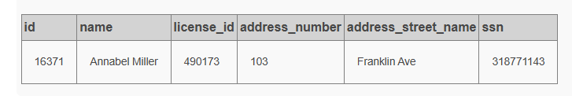

## Paso 5: Revisión de la Entrevista Segundo Testigo.
``` sql
SELECT *
FROM interview
WHERE person_id = 16371;
```
Se consulta la tabla de entrevistas para revisar la declaración de la segunda testigo.
Esta entrevista proporciona pistas importantes sobre el sospechoso.

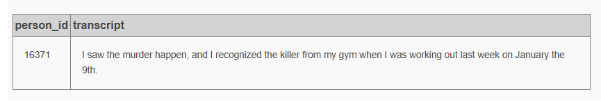

## Paso 6: Investigación de los Miembros del GYM.
``` sql
SELECT *
FROM get_fit_now_member
WHERE membership_status = 'gold'
AND id LIKE '48Z%';
```
A partir de las pistas obtenidas en las entrevistas realizadas a los testigos se investigan los registros del gym.
Está consulta permitió identificar a los miembros con membresía Gold y código que comenzaba con "48Z", características relacionadas con el sospechoso.

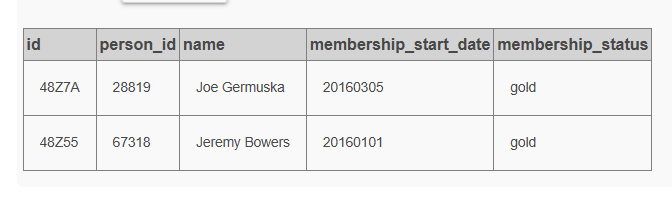

## Paso 7: Revisión de la entrevista del sospechoso.
``` sql
SELECT *
FROM interview
WHERE person_id = 67318;
```
Se realizó la entrevista al sospechoso Jeremy Bowers, quien proporcionó información importante sobre la persona que lo contrató para cometer el crimen.

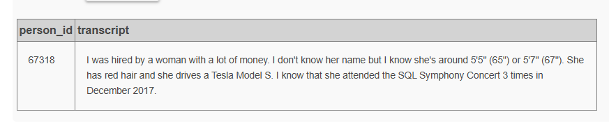

## Paso 8: Búesqueda de la Persona que Contrató al Asesino.
``` sql
SELECT *
FROM drivers_license
WHERE gender = 'female'
AND hair_color = 'red'
AND height BETWEEN 65 AND 67
AND car_make = 'Tesla'
AND car_model = 'Model S'; 
```
Según la declaración de Jeremy Bowers, la persona que lo contrató tenía ciertas características físicas y conducia un vehículo específico.
Se utilizó esta consulta para filtrar posibles sospechosas que coninsidan con la descripción dada en la declaración.

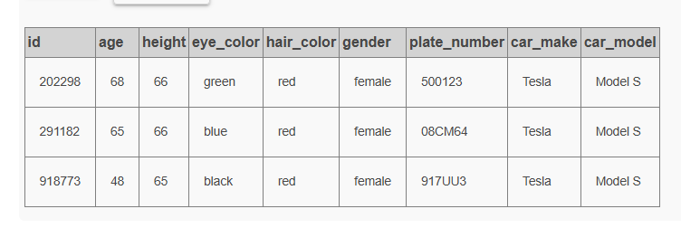

## Paso 9: Identificación de la Sospechosa.
``` sql
SELECT *
FROM person
WHERE license_id IN (
    SELECT id
    FROM drivers_license
    WHERE gender = 'female'
    AND hair_color = 'red'
    AND height BETWEEN 65 AND 67
    AND car_make = 'Tesla'
    AND car_model = 'Model S'
);
```
Está consulta permitió en contrar el nombre de la persona que conincidía con la información obtenida en la declaración de Jeremy Bowers.

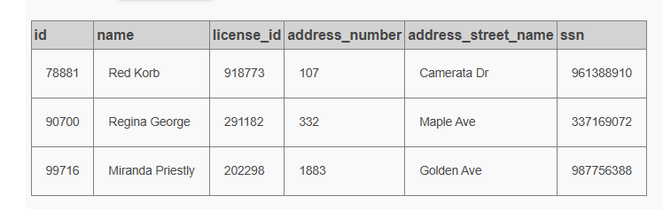

## Paso 10: Verificación de Asistentes al Concierto
``` sql
SELECT person_id, COUNT(*) as veces
FROM facebook_event_checkin
WHERE event_name = 'SQL Symphony Concert'
AND date LIKE '201712%'
GROUP BY person_id
HAVING COUNT(*) = 3;
```
Según la declaración de Jeremy Bowers la persona que lo contrató asistión 3 veces al conciento SQL Symphony Concert en diciembre de 2017.
Esta consulta nos permitió identificar a los asistentes que cumplian con esta condición.

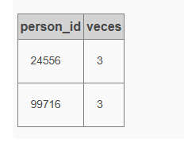

## Paso 11: Indetificación Final del Actor Intelectual del Crimen.
``` sql
SELECT *
FROM person
WHERE id IN (
    SELECT person_id
    FROM facebook_event_checkin
    WHERE event_name = 'SQL Symphony Concert'
    AND date LIKE '201712%'
    GROUP BY person_id
    HAVING COUNT(*) = 3
);
```
Finalmente se lógra identificar a Miranda Priestly como la actora intelectual del crimen.

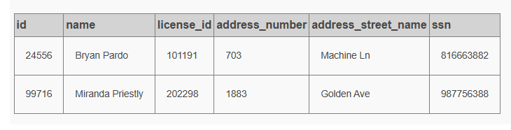

## Se descubre al Asesinó.
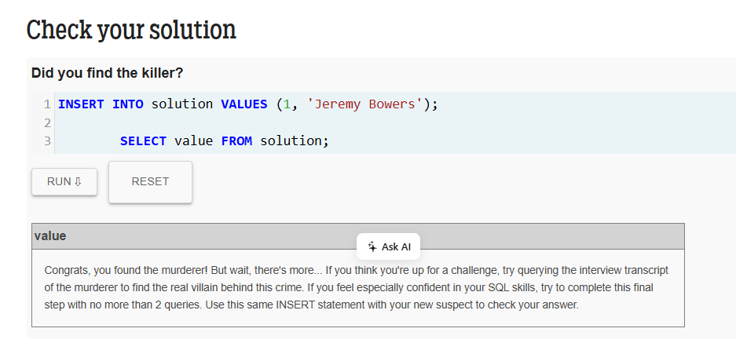

## Se descúbre al Actor Intelectual del Crimen.
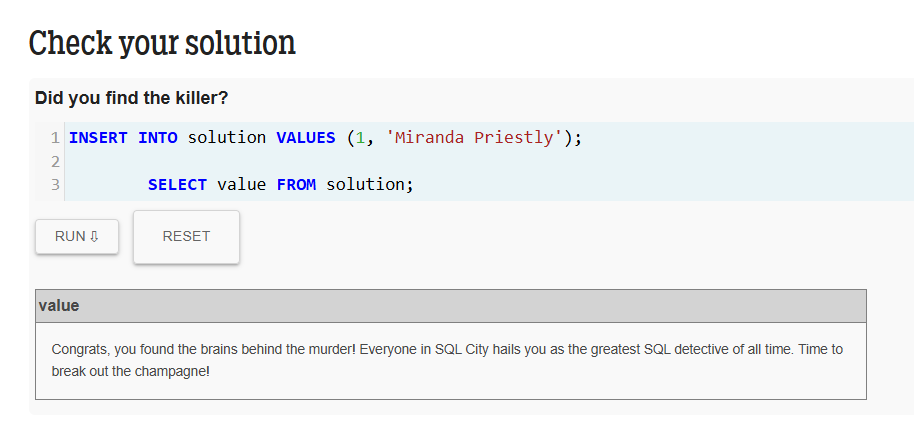